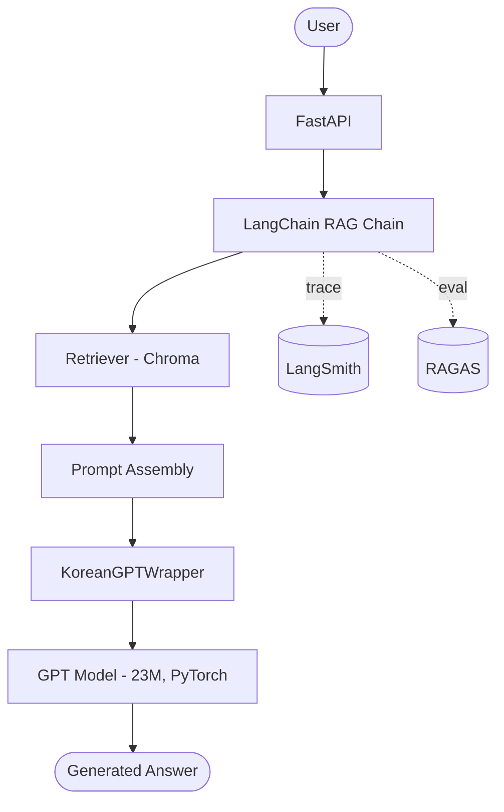
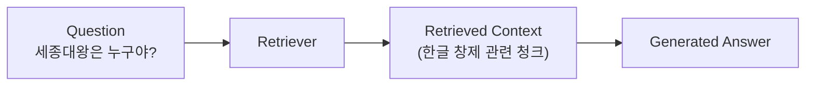
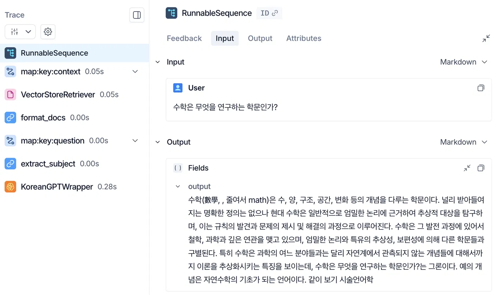
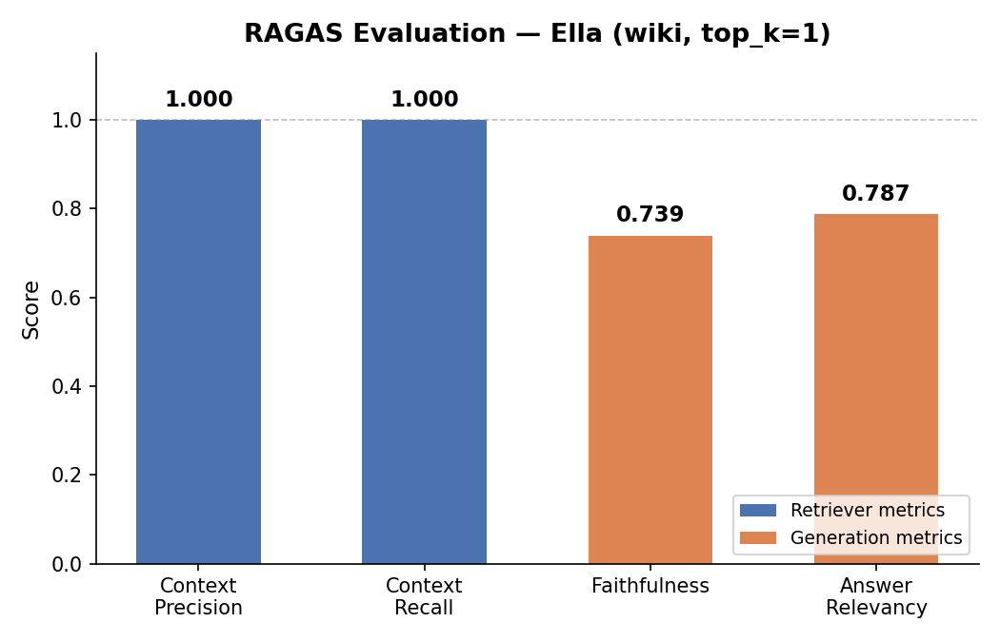

# Korean GPT-style Chatbot from Scratch

한국어 텍스트를 학습해 다음 토큰을 예측하고, 이를 반복 생성하여 문장을 만드는
GPT 스타일 Decoder Transformer 기반 챗봇입니다. PyTorch로 Transformer를 직접
구현했으며, SentencePiece 기반 토크나이저와 FastAPI 서빙 환경을 함께 구성했습니다.

> 부트캠프(KTB4) 과제로 시작했지만, 이후 RAG·벡터DB·모델 교체 등을 단계적으로 추가하며
> 지속적으로 발전시킬 개인 포트폴리오 프로젝트입니다.

## Highlights

- GPT-style Decoder Transformer를 PyTorch로 직접 구현 (self-attention, causal mask 포함)
- 데이터 파싱 버그 발견 및 수정 — 멀티턴 대화 복구로 학습 데이터 6배 증가
- Vanilla RAG와 LangChain RAG를 같은 임베딩·코퍼스로 구현해 동일 조건 비교
- FAISS segmentation fault, Chroma 거리 함수 설정 등 라이브러리 레벨 이슈를 단계적으로 디버깅
- 검색기와 생성 모델의 역할을 분리해, 생성 모델의 표현력이 RAG 품질의 핵심 병목임을 실험으로 확인
- Built an LLM-as-a-Judge evaluation pipeline to quantitatively compare a custom 23M GPT, Gemma 8B, and Gemini 2.5 Flash under the same RAG retrieval pipeline
- Analyzed how different generation models respond to retrieval failure, highlighting hallucination and abstention behaviors
- Registered the evaluation set as a LangSmith Dataset and ran LangSmith Evaluation + RAGAS against the deployed RAG chain, reproducing the LLM-as-a-Judge findings with two independent evaluation tools
- FastAPI 기반 추론 서버 (모델 2종 선택 서빙 + RAG 적용 엔드포인트)

## Architecture Overview



`POST /chat`은 위 흐름에서 Retriever/Prompt 단계 없이 GPT Model로 바로
연결되고, `POST /rag-chat`이 이 전체 체인을 사용합니다.


## Current Status
 
- [x] GPT-style Decoder Transformer 구현
- [x] 위키백과 데이터로 파이프라인 검증
- [x] AI Hub 대화 데이터 재학습
- [x] 멀티턴 대화 학습 버그 발견 및 수정
- [x] Loss Masking 실험
- [x] Vanilla RAG 구현 (검색-생성 파이프라인 동작 확인, 생성 품질은 한계 확인)
- [x] LangChain RAG 마이그레이션 (FAISS→Chroma 전환, 거리 함수 이슈
  해결, Vanilla와 동등한 검색·생성 결과 확인)
- [x] 엘라/Gemma/Gemini 3모델 정량 평가 (평가셋 v1, Judge 채점 완료)
- [x] LangSmith Tracing 적용 (기존 LangChain 체인을 코드 변경 없이 추적)
- [x] FastAPI에 LangChain RAG 체인 연결 (`POST /rag-chat`)
- [x] LangSmith Dataset 등록 및 Evaluation 실행
- [x] RAGAS 평가 (Faithfulness / Context Precision / Context Recall / Answer Relevancy)

## 데모

현재 두 가지 모델이 있습니다.

- **Wiki Model**: 한국어 위키백과 5,000문서 학습
- **Dialog Model**: AI Hub 일상 대화 데이터 87,689건 재학습

### Wiki Model

```bash
curl -X POST http://127.0.0.1:8000/chat \
  -H "Content-Type: application/json" \
  -d '{"message": "오늘 날씨가"}'
```

출력 예시

```text
오늘 날씨가 되는 날씨를 날아 날려오는 날렵하다.
같이 보기 전날: 11월 3일 ...
```

### Dialog Model

입력

```text
<sp1> 오늘 너무 피곤해
```

출력 예시

```text
<sp1> 오늘 너무 피곤해
<sp2> 그러게요. 피곤해서 잤어요?
<sp1> 어제 잠을 안 자서 그런가 잠을 못잤어
<sp2> 그 시간에 푹 자는 건 어때요?
<sp1> 네네 날이 선선하니 좋기는해요
<sp2> 저는 낮잠 자는 날이 싫어요.
```

`<sp1>`, `<sp2>` 화자가 번갈아 응답하며 대화 맥락이 이어지는 형태로 생성됩니다.

### RAG 적용 (`POST /rag-chat`)

```bash
curl -X POST http://127.0.0.1:8000/rag-chat \
  -H "Content-Type: application/json" \
  -d '{"message": "세종대왕은 누구야?"}'
```

Wiki 모델(`model_key="wiki"`, `top_k=1`)에 LangChain RAG 체인을 연결한
엔드포인트입니다. RAG 미적용 `/chat`과 별도로 제공하며, 두 엔드포인트는
계층 관계가 아닌 독립된 기능입니다.

### RAG 적용 전후 비교

같은 질문 "세종대왕은 누구야?"에 검색(RAG)을 붙였을 때와 안 붙였을 때의
차이입니다.

| | RAG 미적용 (Wiki 모델 단독) | RAG 적용 (Vanilla/LangChain 동일) |
|---|---|---|
| 입력 | `세종대왕은` | 세종대왕 관련 검색 청크 + `세종대왕은` |
| 출력 | 학습 데이터 전반의 임의 패턴을 이어씀 (질문과 무관할 수 있음) | "한글", "훈민정음", "세종실록" 등 질문과 관련된 키워드가 반영됨 |

검색을 붙이면 관련 키워드가 반영된다는 점에서 RAG가 의도대로 동작하지만,
23M 규모로 직접 학습한 생성 모델의 표현력 한계로 의미가 통하는 완성된
문장에는 이르지 못했습니다. 자세한 내용은 아래 "RAG 실험" 섹션과
[`docs/training_log.md`](docs/training_log.md)를 참고하세요.





`RunnableSequence`가 `map:key:context`(검색) → `format_docs` →
`map:key:question`(주어 추출) → `KoreanGPTWrapper`(생성) 단계로 트리
구조로 펼쳐져, 각 단계의 소요 시간과 중간 입출력을 실행 결과로 직접
확인할 수 있습니다.

## 아키텍처

```
                    사용자 요청 (POST /chat)
                            │
                            ▼
                    ┌───────────────┐
                    │   api/main.py  │  FastAPI 엔드포인트
                    └───────┬───────┘
                            │
              ┌─────────────┼─────────────┐
              ▼             ▼             ▼
       ┌───────────┐ ┌────────────┐ ┌──────────┐
       │ tokenizer/ │ │   model/   │ │  config/ │
       │  (인코딩)   │ │ (구조 정의) │ │ (설정값)  │
       └─────┬─────┘ └─────┬──────┘ └──────────┘
             │             │
             └──────┬──────┘
                     ▼
            ┌──────────────────┐
            │ inference/        │  반복 생성
            │ generate.py        │  (temperature, top-k, EOS)
            └──────────────────┘
                     │
                     ▼
              생성된 문장 응답
```

**RAG 연동 구조**: 검색기가 찾은 문서를 `inference/generate.py`의 프롬프트 조립
단계에 추가하는 구조로 실제 구현했습니다(`rag/`). `model/transformer.py`(모델
구조 자체)는 변경하지 않았습니다 — RAG는 "모델에 무엇을 입력으로 주는지"의
문제이지, 모델 구조의 문제가 아니기 때문입니다. Vanilla(직접 구현)와
LangChain(프레임워크) 두 버전을 같은 임베딩·코퍼스로 구현해 비교했습니다.
LangChain 버전은 `POST /rag-chat`로 FastAPI에 연결되어 있으며, LangSmith로
Tracing/Dataset/Evaluation을, RAGAS로 Retriever·생성 모델 분리 평가를
수행합니다.

```
              사용자 질문
                   │
                   ▼
            ┌─────────────┐
            │  Retriever   │  Vanilla: NumPy 코사인 유사도
            │             │  LangChain: Chroma + LCEL
            └──────┬──────┘
                   │  관련 청크 top-k
                   ▼
            ┌─────────────┐
            │ Prompt 조립  │  검색된 문서 + 질문 → 하나의 입력
            └──────┬──────┘
                   │
                   ▼
            ┌─────────────┐
            │  GPT Model   │  (model/, inference/ 그대로 재사용)
            └──────┬──────┘
                   │
                   ▼
              생성된 응답
```

`rag/shared/`(임베딩, 코퍼스, 청킹)는 Vanilla·LangChain 공용이며,
`rag/vanilla/`, `rag/langchain/`이 각각 Retriever~Prompt 조립 단계를
다르게 구현합니다. GPT Model 단계(`model/`, `inference/`)는 두 버전이
완전히 동일하게 재사용합니다.

### 모델 구조 (GPT-style Decoder Transformer)

```
입력 토큰 ID 시퀀스
        │
        ▼
토큰 임베딩 + 위치 임베딩 (embed_dim=384)
        │
        ▼
┌─────────────────────────┐
│  Masked Self-Attention    │
│  Add & LayerNorm          │  × 6 layers
│  Feed-Forward (GELU)      │
│  Add & LayerNorm          │
└─────────────────────────┘
        │
        ▼
Linear + Softmax → vocab(16000)에 대한 확률 분포
        │
        ▼
Temperature / Top-k 샘플링 → 다음 토큰 선택 → 반복(autoregressive)
```

## 설계 결정과 이유

이 프로젝트는 "지금 당장 동작하는 코드"가 아니라 "이해하고 설명할 수 있는 코드"를
목표로 진행했습니다. 주요 결정들을 기록합니다.

| 결정 | 선택 | 이유 |
|---|---|---|
| 모델 아키텍처 | LSTM 대신 Decoder Transformer 직접 구현 | RAG로 확장할 때 self-attention 구조를 이해하고 있어야 동작 원리를 설명할 수 있음 |
| `model/` vs `inference/` 분리 | 분리 | RAG가 건드릴 범위(입력 조립)와 건드리지 않을 범위(모델 구조)의 경계를 명확히 하기 위함 |
| 토크나이저 구조 | 독립 `tokenizer/` 모듈 + 클래스로 래핑 | `model/`, `inference/`, 향후 `rag/`에서 공용으로 쓰이는 자원이라 특정 레이어에 종속시키지 않음 |
| vocab size | 16,000 (BPE) | 8,000과 비교했을 때 토큰 분리 품질 차이가 크지 않아, 데이터 양 대비 적정 수준으로 판단 |
| 초기 학습 데이터 | 한국어 위키백과 5,000문서 | AI Hub 대화 데이터는 승인 대기가 필요해, 파이프라인 검증을 먼저 끝내기 위해 위키로 시작 |
| 대화 모델 학습 데이터 | AI Hub 일상 대화 87,689건 | 위키는 서술체라 대화체 응답에 한계가 있어, 승인된 AI Hub 데이터로 교체 학습 |
| 학습 시퀀스 분할 | 겹치지 않는(non-overlapping) 청크 | 슬라이딩 윈도우 방식은 거의 동일한 샘플을 8M개 가까이 생성해 1 epoch에 25만 스텝이 필요했음. 같은 데이터로 998 스텝까지 축소 |
| 디바이스 분리 | 학습은 Colab(GPU), 서빙은 로컬(CPU) | 학습은 GPU 연산량이 필요하지만 추론은 CPU로도 충분히 가능해, 비용/구조 모두에서 합리적 |
| RAG 엔드포인트 네이밍 | `/rag-chat` (`/chat/rag` 대신) | `/chat`(RAG 없음)과 RAG 적용 버전은 계층 종속 관계가 아니라 독립된 기능이므로, 계층형 경로 대신 평행한 경로로 표현 |
| RAGAS judge/embeddings | `ChatGoogleGenerativeAI` + `GoogleGenerativeAIEmbeddings` 명시 | RAGAS가 기본값으로 OpenAI 임베딩을 요구해 `OPENAI_API_KEY` 에러가 발생하므로, 프로젝트에서 이미 쓰던 Gemini로 명시적으로 대체 |

## 모델 비교 요약

| Model | Loss | 특징 |
|---|---|---|
| Wiki | 4.47 | 위키 문체(서술체) 학습, 대화체 응답에는 한계 |
| Dialog v1 | 2.23 | 화자 토큰 생성 가능, 화자 전환 패턴은 제한적 (데이터 파싱 버그로 1턴만 학습) |
| Dialog v2 | 3.60 | 버그 수정 후 멀티턴 대화 복구, 화자 전환 응답 패턴 관찰 |
| Loss Masking | 3.59 | 응답 생성에 학습 신호 집중, 더 적은 데이터로 빠른 개선 경향 (실험용 체크포인트) |
| Vanilla RAG | - | 검색 결과가 생성에 반영됨을 확인. 다만 생성 모델 한계로 안정적인 QA 응답 생성에는 미달 |
| LangChain RAG | - | Vanilla와 동일한 임베딩/코퍼스/생성 모델 사용 시 검색·생성 결과가 본질적으로 동일함을 확인 (프레임워크 차이가 생성 품질을 바꾸지 않음) |
| 엘라 vs Gemma vs Gemini (평가셋 v1, Judge: Gemini, 5점 만점) | 엘라 1.23 / Gemma 4.57 / Gemini 4.00 | 동일한 검색기로 10문항 평가, 생성 모델만 변경. 검색 실패 시(Q10) 엘라는 무관한 내용을 생성했으나 Gemma·Gemini는 정보 부족을 인지하고 답변을 거부(hallucination 회피) |
| LangSmith Evaluation (엘라, `/rag-chat` 체인, Judge: Gemini) | accuracy/relevance/fluency 대부분 0~2점(5점 만점) | 평가셋 v1을 LangSmith Dataset으로 등록해 운영 도구 기준으로 재평가. LLM-as-a-Judge와 동일한 결론("생성 품질이 낮다")을 재현. Q10에서도 hallucination이 그대로 재현되어 0점 — 검색 실패에 대한 정보 부족 인지 능력이 애초에 없는 모델에는 해당 특례가 적용되지 않음 |
| RAGAS (엘라, `/rag-chat` 체인) | Context Precision 1.000 / Context Recall 1.000 / Faithfulness 0.739 / Answer Relevancy 0.787 | Retriever와 생성 모델의 기여도를 분리해 측정. Retriever는 거의 완벽하나 생성 단계에서 품질이 떨어짐 — Vanilla RAG·LangSmith Evaluation과 동일한 결론을 정량 지표로 재확인 |

> Loss는 학습 방식·데이터 규모가 서로 달라 절대값으로 모델 우열을 가릴 수
> 없습니다(예: Dialog v1의 낮은 loss는 더 쉬운 1턴 과제를 풀었기 때문). 자세한
> 비교와 근거는 아래 실험 과정과 [`docs/training_log.md`](docs/training_log.md)를 참고하세요.
>
> 이 결과는 Evaluation v1의 검색 실패 사례(Q10, 질문 표현이 주어 추출
> 정규식과 맞지 않아 발생한 검색 쿼리 전처리 이슈)에서 관찰된 결과이며,
> 더 다양한 검색 실패 사례를 포함한 후속 평가가 필요합니다. 또한 Gemini는
> "모른다"고 답하도록 프롬프트에 명시적으로 지시한 반면 Gemma는 별도
> 지시 없이 같은 대응을 보여, 완전히 동일한 조건의 비교는 아닙니다.
>
> LangSmith Evaluation과 RAGAS는 서로 다른 방식(LLM Judge 채점 vs
> Retriever/생성 분리 지표)으로 접근했지만, 결국 같은 결론(검색보다
> 생성 모델이 병목)을 가리켰습니다.



Retriever 지표(파랑)는 만점에 가깝고 생성 지표(주황)만 낮다는 것이
한눈에 보입니다 — Vanilla RAG 실험(5절)부터 반복 관찰된 "검색은 잘
되는데 생성이 약하다"는 결론이 그래프로도 드러납니다.

## 주요 실험 과정 (요약)

1. **위키 모델 학습** — 위키백과로 전체 파이프라인(모델 구현 → 토크나이저 → 학습 → 생성 → FastAPI) 검증
2. **AI Hub 대화 데이터 재학습 (v1)** — 화자 토큰(`<sp1>~<sp5>`) 도입, 화자 전환의 의미적 학습은 제한적
3. **데이터 파싱 버그 발견 및 재학습 (v2)** — `return` 위치 버그로 대화가 1턴으로 잘려있었음을 발견, 수정 후 코퍼스 6배 증가
4. **Loss Masking 실험** — 다음 턴 생성에만 학습 신호 집중, 적은 데이터로도 빠르게 일관된 응답에 도달하는 경향 확인
5. **Vanilla RAG 구현** — 청킹·임베딩·검색·프롬프트 조립·생성을 직접 구현, 검색은 정확했으나 생성 모델의 한계가 드러남
6. **LangChain RAG 마이그레이션** — FAISS segfault, Chroma 거리 함수 문제를 디버깅해 해결, Vanilla와 결과가 본질적으로 동일함을 확인
7. **엘라 vs Gemma vs Gemini 정량 평가** — 평가셋 v1(10문항)로 LLM-as-a-Judge 채점, 엘라 1.23 / Gemma 4.57 / Gemini 4.00(5점 만점)
8. **LangSmith Tracing 적용** — 기존 체인을 코드 변경 없이 환경변수만으로 Tracing, 단계별 소요 시간과 중간 입출력 확인
9. **LangSmith Dataset / Evaluation** — 평가셋 v1을 Dataset으로 등록해 운영 도구 기준으로 재평가, LLM-as-a-Judge와 동일한 결론 재현
10. **RAGAS 평가** — Context Precision/Recall, Faithfulness, Answer Relevancy로 Retriever·생성 모델 기여도 분리, 같은 결론을 정량 지표로 재확인

각 단계의 상세 결과(loss 곡선, epoch별 생성 샘플, 코드, 디버깅 과정)는
[`docs/training_log.md`](docs/training_log.md)에, 3모델 비교 실험은
[`docs/evaluation_v1_comparison.md`](docs/evaluation_v1_comparison.md)에
기록되어 있습니다.

## 프로젝트 구조

```
korean-chatbot/
├── api/             # FastAPI 라우터 (POST /chat, POST /rag-chat)
├── config/          # 하이퍼파라미터, 경로 등 설정값
├── data/            # 원본/전처리 텍스트 데이터 (git 비추적)
├── tokenizer/        # SentencePiece 로딩/인코딩 래퍼
├── model/           # GPT 스타일 Decoder Transformer 구조 정의
├── inference/        # 반복 생성 로직 (temperature/top-k/EOS)
├── train/           # Colab에서 실행하는 학습 스크립트
├── rag/             # Vanilla/LangChain RAG 파이프라인, 평가 스크립트
├── artifacts/        # 학습된 가중치(.pt), 토크나이저 파일 (git 비추적)
├── tests/
├── docs/             # 학습 결과 그래프, training_log.md 등 문서 자료
└── README.md
```

`artifacts/`의 모델 가중치와 토크나이저 파일은 용량 문제로 git에 포함하지 않았습니다.
재현 방법은 `train/train.py`를 참고하세요.

## 실행 방법

```bash
# 가상환경 설정
uv venv
source .venv/bin/activate
uv pip install -r requirements.txt

# artifacts/ 에 학습된 모델(gpt_dialog_latest.pt)과
# artifacts/tokenizer/ 에 토크나이저(ko_sp_dialog_16k.model) 파일을 위치시킨 뒤

uvicorn api.main:app --reload
```

RAG 평가 스크립트(`rag/langchain/build_dataset.py`,
`run_evaluation.py`, `evaluate_ragas.py`)를 실행하려면 `.env`에
`GEMINI_API_KEY`, `LANGCHAIN_API_KEY`가 필요합니다.

## 향후 계획
 
현재 구현은 1단계이며, 다음 항목들을 단계적으로 추가할 예정입니다. 구조상 RAG 추가 시
`inference/`와 신규 `rag/` 모듈만 영향을 받도록 설계했습니다. RAG는 부트캠프 과제
요구사항에 따라 Vanilla 구현 후 LangChain으로 마이그레이션하는 순서로 진행합니다.
 
- [x] AI Hub 대화 데이터로 재학습 (화자 토큰, `<eot>` 도입)
- [x] 데이터 파싱 버그 수정 및 재학습 — 멀티턴 대화 복구, 화자 전환 응답 패턴 확인
- [x] Loss masking 적용 — 응답 생성에 학습 신호 집중 (체크포인트로 보존,
  현재 서빙 모델에는 미적용)
- [x] Vanilla RAG 직접 구현 (`rag/vanilla/`) — 청킹, 임베딩, 검색, 프롬프트
  조립까지 전 단계를 라이브러리 없이 구현. 검색-생성 파이프라인 동작 확인,
  생성 모델 표현력이 RAG 품질의 핵심 병목임을 확인
- [x] FastAPI에 LangChain RAG 연결 (`POST /rag-chat`)
- [x] LangChain 기반 RAG로 마이그레이션 (`rag/langchain/`) — 같은 임베딩·
  데이터를 공유해 Vanilla 버전과 구조/코드량/결과 비교. FAISS→Chroma
  전환, 거리 함수 이슈 해결 과정을 포함해 비교 항목에 디버깅
  가능성·설정 명시성을 추가
- [x] LangSmith로 체인 실행 Tracing 적용
- [x] LangSmith Dataset 등록 및 Evaluation 실행
- [x] RAGAS 기반 자동 평가 (Faithfulness / Context Precision / Context
  Recall / Answer Relevancy)
- [ ] GitHub Release v1.0
- [ ] AI Interview Coach 프로젝트 시작 (별도 Repository — Gemini +
  LangChain + RAG + RAGAS 기반 미니 프로젝트)
- [ ] 벡터DB 연동 (FAISS/Chroma) — 위 RAG 실험을 실제 서비스 구조로 확장
- [ ] 대화 히스토리 저장, 세션 관리
- [ ] 모델 교체 가능한 추상화 계층 (`BaseLanguageModel`)
- [ ] Docker 기반 배포

## 기술 스택

Python 3.12 · PyTorch · SentencePiece · FastAPI · Uvicorn · Pydantic ·
LangChain · Chroma · LangSmith · RAGAS · Gemini API