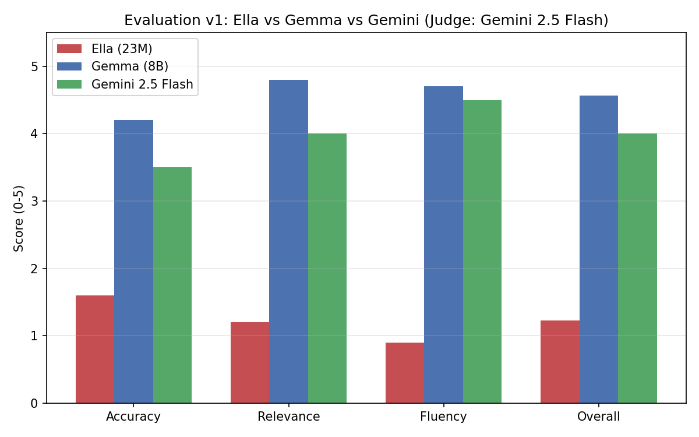

# Evaluation v1 — 세 모델 종합 비교 (엘라 / Gemma 4 8B / Gemini 2.5 Flash)

`docs/evaluation_dataset_v1.md`의 10개 질문에 대해 엘라 모델(23M,
직접 구현), Gemma 4(8B, Ollama 로컬), Gemini 2.5 Flash(API) 세
모델의 응답을 비교합니다. 개별 응답 전체는 `evaluation_v1_results_ella.md`,
`evaluation_v1_results_gemma.md`, `evaluation_v1_results_gemini.md`에
있습니다.

## 실험 설계: 변수 통제

세 모델 모두 다음을 동일하게 사용했습니다.

- **코퍼스**: 한국어 위키백과 1,000문서
- **임베딩**: `jhgan/ko-sroberta-multitask`
- **Retriever**: `rag/vanilla/retriever.py` (NumPy 코사인 유사도)
- **검색 결과**: 같은 질문에 대해 동일한 청크가 검색됨 (엘라는
  `max_seq_len=256` 제약으로 `top_k=1`, Gemma/Gemini는 `top_k=3`)

바뀐 것은 **생성 모델(LLM)뿐**입니다. 즉 이 실험은 "검색기가 아니라
생성 모델이 RAG 품질에 얼마나 영향을 미치는가"를 통제된 조건에서
비교한 것입니다.

## 모델별 특징 요약

| 항목 | 엘라 (23M) | Gemma (8B) | Gemini 2.5 Flash |
|---|---|---|---|
| 검색 성공 시 | 일부 키워드만 반영, 문장은 무너짐 | 정확하고 자연스러움 | 정확하고 간결함 |
| 문장 자연스러움 | 낮음 | 높음 | 매우 높음 |
| 답변 길이 | 길지만 불안정(반복·이탈) | 설명형 | 매우 간결 |
| 검색 실패(Q10) 대응 | 무관한 내용을 그대로 생성 | "정보가 없습니다"로 답변 거부 | "모른다"로 답변 거부 |

## Q10이 보여준 것: Hallucination 대응의 차이

Q10에서는 세 모델 모두 **같은, 검색이 실패한 청크**를 받았습니다.
이 조건에서 세 모델의 대응이 갈렸습니다.

- **엘라 모델**: 무관한 검색 결과를 그대로 이어 의미 없는 내용을
  생성했습니다.
- **Gemma / Gemini**: 둘 다 답변을 거부했습니다.

여기서 핵심은 "모른다고 답했다"는 사실 자체가 아니라, **잘못된
정보를 그럴듯하게 만들어내지 않았다(hallucination을 피했다)**는
점입니다. RAG 시스템에서는 검색이 항상 성공할 수 없으므로, 검색이
실패했을 때 모델이 그 사실을 인지하고 적절히 대응하는 능력이 실제
서비스 신뢰성에 직결됩니다. 동일한 검색 결과(실패한 검색)를
입력받았음에도 생성 모델에 따라 최종 응답의 신뢰성이 크게
달라졌습니다. 이는 RAG 시스템의 품질이 검색뿐 아니라 생성 모델의
특성에도 크게 의존함을 보여줍니다.

## 이번 실험의 한계

- 엘라 모델은 `max_seq_len=256` 제약으로 `top_k=1`만 사용할 수 있었고,
  Gemma/Gemini는 `top_k=3`을 사용했습니다. 동일한 Retriever와 코퍼스를
  사용했지만, 입력 컨텍스트의 양 자체는 동일하지 않았습니다.
- Gemini에는 "정보가 없으면 모른다고 답하라"는 지시를 프롬프트에
  추가했으나, Gemma에는 이 지시가 없었습니다(그럼에도 스스로 정보
  부족을 인지함). 완전히 동일한 프롬프트 조건은 아닙니다.
- 질문 수가 10개로 제한되어 있어, 이 결과를 일반적인 성능 차이로
  단정할 수는 없습니다. 카테고리/유형을 다양화한 v2(30문항)로
  확장하면 더 신뢰할 수 있는 비교가 가능합니다.
- 정량 평가(Judge 채점)는 1회 채점 결과이며, 반복 채점을 통한 평균은
  아직 구하지 않았습니다(아래 "정량 평가의 한계" 참고).

## 정량 평가 (LLM-as-a-Judge: Gemini 2.5 Flash)

LLM-as-a-Judge 방식으로 Gemini 2.5 Flash를 Judge 모델로 사용해
정확성·관련성·자연스러움 세 기준을 채점했습니다.
`docs/evaluation_v1_judge_scores.json`에 10문항 × 3모델의 전체 채점
결과(점수 + 채점 이유)가 있습니다. `rag/eval_external/plot_judge_scores.py`
로 아래 평균과 그래프를 재생성할 수 있습니다.

### 모델별 평균 (10문항, 0~5점)

| 모델 | 정확성 | 관련성 | 자연스러움 | 전체 평균 |
|---|---|---|---|---|
| 엘라 (23M) | 1.6 | 1.2 | 0.9 | **1.23** |
| Gemma (8B) | 4.2 | 4.8 | 4.7 | **4.57** |
| Gemini 2.5 Flash | 3.5 | 4.0 | 4.5 | **4.00** |

### 질문별 평균 점수 (세 기준 평균)

| 질문 | 엘라 | Gemma | Gemini |
|---|---|---|---|
| Q1 지미 카터 | 1.0 | 4.3 | 5.0 |
| Q2 백남준 | 2.0 | 5.0 | 1.7 |
| Q3 데니스 리치 | 0.0 | 5.0 | 4.3 |
| Q4 우크라이나 | 1.0 | 4.7 | 5.0 |
| Q5 체첸 공화국 | 1.0 | 4.0 | 4.7 |
| Q6 수학 | 2.3 | 5.0 | 5.0 |
| Q7 화학 | 2.3 | 5.0 | 5.0 |
| Q8 초월수 | 0.0 | 4.7 | 2.0 |
| Q9 맥스웰 방정식 | 2.7 | 5.0 | 5.0 |
| Q10 세종대왕(검색 실패) | 0.0 | 3.0 | 2.3 |

### 정량 결과에서 발견한 점

- **엘라(1.23)와 Gemma/Gemini(4.0~4.6) 사이의 격차가 매우 큽니다.**
  이는 지금까지의 정성적 관찰("키워드는 일부 반영되지만 의미가 통하는
  문장을 만들지 못한다")을 숫자로도 확인해 줍니다.
- **Evaluation v1에서는 Gemma(4.57)가 Gemini(4.00)보다 더 높은 평균
  점수를 기록했습니다.** 이 결과를 "Gemma가 Gemini보다 우수하다"로
  일반화하기는 조심스럽습니다 — Q8(초월수) 한 문항의 점수 차이가
  평균에 크게 영향을 주었고, 질문 수도 10개로 적기 때문입니다. Q8에서
  Gemini는 검색 결과에 정의가 포함되어 있었음에도 "직접적인 정의가
  없다"고 판단해 정확성/관련성 점수를 0~1점 받았습니다. 이번 실험에서는
  Gemini가 검색된 정보를 충분하지 않다고 판단해 답변을 보수적으로
  생성한 것으로 보이며, 이를 모델의 일반적인 성향으로 단정하기는
  어렵습니다.
- **Q10(검색 실패)에서는 Gemma·Gemini 모두 정확성 0점이지만 관련성·
  자연스러움은 높게 받았습니다**(Gemma 관련성 4, 자연스러움 5 / Gemini
  관련성 3, 자연스러움 4). Judge가 "정보 부족을 정직하게 인정한
  것"을 정확성과 분리해서 평가했다는 뜻으로, 프롬프트에 명시한 채점
  지침("정직한 거부는 관련성에서 높은 점수 가능")이 의도대로
  반영되었습니다.

### 대표 사례: 검색 실패(Q10)에 대한 세 모델의 대응

| 질문 | 엘라 | Gemma | Gemini |
|---|---|---|---|
| Q10 (세종대왕, 검색 실패) | 무관한 배우·영화인 목록 생성 | "정보가 없습니다" | "모른다." |

같은 검색 실패를 받았을 때, 엘라는 hallucination을 일으켰고
Gemma/Gemini는 정직하게 답변을 거부했습니다. 이 한 가지 사례가
평균 점수표보다 세 모델의 차이를 더 직접적으로 보여줍니다.

## 정량 평가의 한계

- Judge 모델(Gemini 2.5 Flash)이 평가 대상 세 모델 중 하나(Gemini)와
  동일합니다. 자기참조 가능성을 배제할 수 없습니다.
- 점수는 단일 채점 회차의 결과입니다. LLM judge는 같은 입력에도
  매번 다른 점수를 낼 수 있어, 반복 채점 후 평균을 내면 더 안정적인
  값을 얻을 수 있습니다(이번에는 비용/시간상 1회만 진행).
- 질문이 10개로 적어, 위 평균값의 통계적 신뢰도는 높지 않습니다.

## 이 실험이 보여주는 것

이 프로젝트는 처음에는 "23M GPT를 직접 만든다"는 것이 중심이었습니다.
이번 평가를 통해, 같은 RAG 시스템에서 생성 모델만 바꿨을 때 결과가
어떻게 달라지는지를 통제된 실험으로 분석하고, Judge 기반 정량 평가
(엘라 1.23 vs Gemma 4.57 vs Gemini 4.00, 5점 만점)로 그 차이를 숫자로
검증하는 단계까지 발전했습니다. 이는 "엔진을 만들 줄 알고, 그것을
분석하고 평가할 줄 아는 사람"이 되어야 한다는 멘토링 피드백
(`docs/mentoring_notes.md`)과 직접 연결되는 결과입니다.