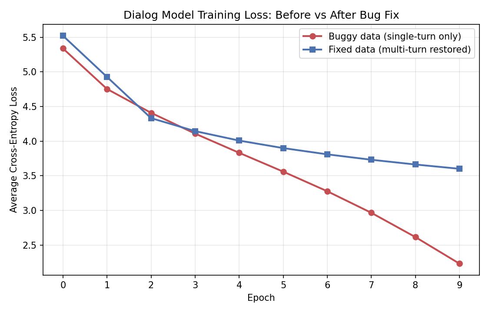

# Training Log

이 문서는 `Korean GPT-style Chatbot from Scratch` 프로젝트의 전체 학습 실험
기록입니다. README의 "주요 실험 과정 요약"에서 이어지는 상세 내용입니다.

## 1. Wiki 모델 학습

5 epoch, 위키백과 5,000문서(약 820만 토큰) 기준입니다.


| Epoch | Avg Loss | 샘플 생성 (prompt: "오늘 날씨가") |
|---|---|---|
| 0 | 6.83 | `이다. 는 이다. (go cat) ...` |
| 1 | 5.57 | `이는 중국, 그 내용은 아니다. 같은 해 10월 12일 ...` |
| 4 | 4.47 | `되는 날씨를 날아 날려오는 날렵하다. 같이 보기 전날: 11월 3일 ...` |

문법적 조각(조사, 어미, 위키 특유의 "같이 보기" 구조)은 학습되고 있으나, 위키백과가
서술체 데이터라 자연스러운 대화체 응답에는 한계가 있습니다.

## 2. AI Hub 대화 데이터 재학습 (Dialog v1)

AI Hub "주제별 텍스트 일상 대화 데이터"(dataSetSn=543)로 재학습했습니다. 카카오톡 등에서
수집한 일상 대화 87,689건(20개 주제, 평균 3턴/대화)을 화자 정규화(`<sp1>~<sp5>`)와
대화 종료 토큰(`<eot>`), 길이 보존 마스킹 토큰(`<mask1>~<mask8>`)으로 전처리해
새 토크나이저(`ko_sp_dialog_16k`)를 학습하고, 같은 모델 구조(384/6/6)로 10 epoch 학습했습니다.

| 결정 | 선택 | 이유 |
|---|---|---|
| 화자 표현 | `<sp1>~<sp5>` (대화 내 등장 순서로 정규화) | 원본 화자 ID가 가변적이어도 고정된 작은 vocab으로 표현 가능하며, 화자 교대(질문-응답) 구조를 보존하기 위함 |
| 대화 종료 | `<eot>` | 대화 경계를 모델이 학습하도록 함. 추론 시 생성 종료 신호로도 `<eot>`를 사용(`<eos>`와는 별개 역할로 유지) |
| 익명화 토큰 | `<mask1>~<mask8>` | AI Hub의 길이 보존 마스킹(`*`, `**`, `***`...) 정보를 유지해 호칭+조사 패턴 학습에 활용 |
| 시퀀스 길이 (초기 실험) | `max_seq_len=128` (위키 256에서 축소) | 당시 코퍼스가 버그로 1턴만 남아 있어, 대화가 짧다고 판단해 줄임 (버그 수정 후 256으로 환원 — 아래 참고) |

**학습 결과** (87,689개 대화, 약 101만 토큰, 모델 파라미터 약 23M, 10 epoch)

| Epoch | Avg Loss | 샘플 생성 (prompt: `<sp1> 오늘 너무 피곤해`) |
|---|---|---|
| 0 | 5.34 | `나 요즘 다 어떻게 생각해? <eot> 아 오늘 회사 좀 너무 힘들어 ...` |
| 4 | 3.83 | `오늘 진짜 오랜만에 집 매매하고 싶어서? <eot> 요즘은 아파트 값이 너무 좋아 ...` |
| 9 | 2.23 | `우리 강아지 미용 간다~ <eot> 오늘 날씨 추워지니까 벌써 일이다... <eot> 회사 출근하기 너무 좋다~` |

`<eot>` 경계와 "~", "...", "키키", "ㅠㅠ" 같은 구어체 어미가 학습 초반부터 안정적으로
나타났고, loss도 위키 모델보다 더 낮은 수준(2.23)까지 떨어졌습니다.

### 발견한 한계 (당시)

화자 토큰(`<sp1>`, `<sp2>`)이 텍스트로서는 정상 생성되었지만, *화자 전환*이라는
의미적 역할까지는 학습되지 않았습니다.

```
prompt: <sp1> 오늘 너무 피곤해\n<sp2>
output: <sp1> 오늘 너무 피곤해 <sp2>... <eot> ...
```

`<sp2>`가 새로운 응답의 시작이 아니라 `<sp1>` 발화 중간에 등장하는 토큰처럼
처리됩니다. 멀티턴 프롬프트(`<sp1> 오늘 너무 피곤해\n<sp2> 왜?\n<sp1> 야근했거든\n<sp2>`)로
테스트했을 때도 의미 있는 응답 대신 즉시 종료되는 패턴이 나타났습니다.

당시에는 정확한 원인을 알 수 없었고, 학습 방식·데이터 구성·데이터 규모를
후보로 추정했습니다. 화자 전환 패턴이 충분히 학습되지 않은 이유로는 다음이
복합적으로 영향을 준 것으로 보았습니다.

- Next Token Prediction 학습 방식의 한계 (통계적으로 빈번한 패턴인 조사, 어미를
  먼저 학습하고, "직전 발화를 이해하고 응답하는" 패턴은 신호가 희소해 늦게 학습됨)
- 대화 전체를 한 번에 제공한 데이터 구성 방식 ("이전 턴까지 주고 다음 턴을 맞히는"
  형태가 아니었음)
- 상대적으로 작은 데이터 규모

추가로, temperature/top-k 샘플링 특성상 같은 입력에도 호출마다 생성 품질 편차가
큽니다(예: 같은 prompt가 자연스러운 문장과 의미 없는 단어 나열을 번갈아 생성).
소규모 모델·데이터 규모에서 나타나는 자연스러운 현상으로 판단했습니다.

## 3. 데이터 파싱 버그 발견과 재학습 (Dialog v2)

### 코퍼스 규모 변화

| 항목 | 버그 있던 버전 | 수정 후 |
|---|---|---|
| 대화 수 | 87,689개 | 87,689개 (동일) |
| 코퍼스 줄 수 | 263,067줄 | 1,612,484줄 (약 6.1배) |
| 전체 토큰 수 | 약 101만 | 약 1,490만 (약 14.8배) |
| 평균 대화 길이 | 약 3턴 | 약 18.4턴 |

위 한계를 검증하기 위해 "이전 턴까지 주고 다음 턴을 예측하는" 학습 샘플을
직접 만드는 작업을 시작했는데, 그 과정에서 `data/preprocess.py`의 `parse_dialog()`에
**`return` 위치 버그**가 있다는 것을 발견했습니다. 함수 내부 `for` 루프 안에
`return`이 있어, 매 파일의 **첫 발화 한 줄만 읽고 즉시 반환**하고 있었습니다.

```python
# 버그가 있던 코드 (return이 for 루프 내부에 위치)
for line in f:
    ...
    if utterance:
        lines.append((speaker_id, utterance))
        return lines  # 첫 줄에서 즉시 종료됨

# 수정 후 (return을 루프 밖으로)
for line in f:
    ...
    if utterance:
        lines.append((speaker_id, utterance))
return lines
```

실제로 원본 raw 파일은 평균 18턴 이상의 멀티턴 대화였지만, 버그로 인해 학습
코퍼스에는 **거의 모든 대화가 1턴으로 잘려** 들어가 있었습니다. 화자 전환을
학습하지 못한 근본 원인이 데이터 자체에 있었던 것입니다.

버그를 수정하고 같은 학습 방식(전체 시퀀스에 loss 계산)으로 재학습한 결과,
별도의 학습 구조 변경 없이도 화자 전환이 뚜렷하게 개선되었습니다.

**재학습 결과** (87,689개 대화, 약 1,490만 토큰, `max_seq_len=256`으로 환원, 10 epoch)



위 그래프에서 버그 있던 데이터(빨강)의 loss가 더 낮게 떨어지는 것은 모델이
더 잘 학습됐다는 뜻이 아니라, 1턴짜리 과제가 더 쉬웠기 때문입니다. 수정된
데이터(파랑)는 멀티턴 맥락을 다뤄야 하는 더 어려운 과제를 풀고 있어 loss가
더 높게 유지되지만, 실제 생성 품질은 명확히 더 낫습니다.

| Epoch | Avg Loss | 샘플 생성 (prompt: `<sp1> 오늘 너무 피곤해`) |
|---|---|---|
| 0 | 5.52 | (학습 시작) |
| 5 | 3.90 | `<sp2> 내일도 반팔 입고 나가지 않을까? <sp1> 맞아 얇고 더운거 같아 ...` |
| 7 | 3.73 | `<sp2> 키키 오늘 날씨 좋아? 키키 <sp3> 오 너무 좋다! ... <sp2> 나는 진짜 퇴사하고 싶다 ᅲᅲ <sp3> 나도 그래!` |
| 9 | 3.60 | `<sp2> 오늘 저녁시간이 4시더라고 ᅲᅲ <sp3> 너무 늦은 시간에 늦었는데 <sp1> 다들 아침 잘 챙겨 먹고 잘 챙겨!` |

최종 loss(3.60)는 버그가 있던 버전(2.23)보다 높지만, 이는 나쁜 신호가 아닙니다.
학습 데이터가 6배 늘고 시퀀스 길이도 늘어 과제 자체가 더 어려워졌기 때문이며,
실제 생성 품질은 명확히 개선되었습니다. `<sp2>`, `<sp3>`가 직전 발화에 대한
공감·맞장구·되묻기로 응답하는 패턴이 여러 epoch에서 일관되게 나타났습니다.

이번 경험으로 얻은 교훈은, 처음 세운 가설(학습 방식 자체의 한계)을 검증하기
전에 **데이터 파이프라인이 정확한지부터 확인해야 한다**는 것이었습니다.
Loss masking("이전 턴은 loss 계산에서 제외하고 다음 턴 생성에만 집중") 같은
학습 방식 개선은 여전히 의미 있는 다음 단계지만, 그 효과를 제대로 측정하려면
먼저 데이터가 온전한 상태여야 합니다.

## 4. Loss Masking 실험

데이터 버그 수정 후, 원래 가설이었던 학습 방식 개선(loss masking)을 마저
검증했습니다. 각 대화를 턴 경계마다 (이전 턴들, 다음 턴) 쌍으로 재구성하고,
`F.cross_entropy`의 `ignore_index=-100`을 이용해 이전 턴 부분은 loss 계산에서
제외했습니다. 정답 부분(다음 턴)에만 학습 신호가 집중되도록 한 것입니다.

```python
loss = F.cross_entropy(
    logits.view(-1, logits.size(-1)),
    y.view(-1),
    ignore_index=-100,  # 이전 턴 위치는 loss 계산에서 제외
)
```

134만 개 턴 단위 샘플 전체를 한 번에 텐서로 변환하려다 Colab 메모리 부족으로
런타임이 다운되는 일이 있어, 30만 개를 무작위로 샘플링해 사용했습니다(검증
목적에는 충분한 규모로 판단). 처음 만든 `Dataset`이 매 배치마다 패딩 연산을
반복해 1 epoch에 4시간 이상 걸렸는데, 패딩을 미리 텐서로 만들어두는 방식으로
바꾸고 batch_size를 32→64로 늘려 약 10배 빠르게 개선했습니다.

**실험 결과** (30만 샘플, `max_seq_len=256`, 5 epoch)

| Epoch | Avg Loss | 샘플 생성 (prompt: `<sp1> 오늘 너무 피곤해`) |
|---|---|---|
| 0 | 5.33 | `<sp2> 벌써 여름 겨울도 안 나더라` (맥락 무관) |
| 2 | 4.18 | `<sp2> 무슨일이야? <sp1> 오늘 좀 잤어? ...` (직접 반응 시작) |
| 3 | 3.87 | `<sp2> 갑자기 겨울이 왔다 갔다. <sp1> 맞아 바람도... <sp2> 맞아 기온이 되게 좋았어` |
| 4 | 3.59 | `<sp2> 오늘 너무 화창해 <sp1> 무슨일이야` (epoch 3보다 다소 단조로워짐) |

Epoch 3에서 화자들이 "맞아"로 공감하며 대화를 자연스럽게 이어가는, 지금까지
중 가장 일관된 응답이 나타났습니다. Epoch 4는 오히려 다소 단조로워졌는데,
데이터를 30만 개로 줄인 상태에서 5 epoch을 돈 것이 과적합 초기 단계에
들어선 것으로 추정합니다. 같은 epoch 수 기준으로 비교하면 loss masking
버전이 더 적은 데이터로도 일관된 응답 패턴에 더 빠르게 도달하는 경향을
보였으나, 데이터 양과 epoch 수가 달라 엄밀한 비교는 아닙니다.

이번 실험은 별도 체크포인트(`gpt_dialog_loss_masked.pt`)로 보존하고,
FastAPI가 서빙하는 기본 dialog 모델은 더 많은 데이터(134만 토큰 전체)로
검증된 기존 버전(Dialog v2)을 유지했습니다. RAG를 추가하는 시점에 모델
입력 형태가 다시 바뀌므로, 그 때 어떤 버전을 기반으로 할지 다시 판단할
계획입니다.

## 5. 향후 실험 (예정)

- Vanilla RAG 구현 결과
- LangChain RAG 마이그레이션 결과
- LangSmith Tracing/평가 결과

(이 섹션은 각 단계가 진행되면서 계속 갱신됩니다.)